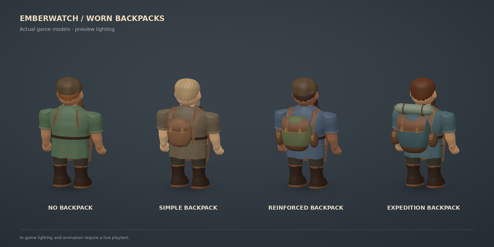
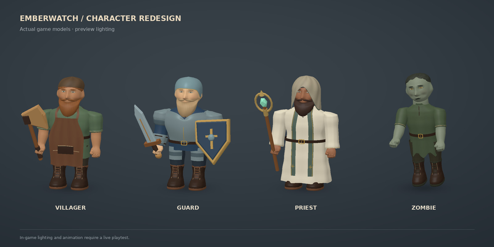
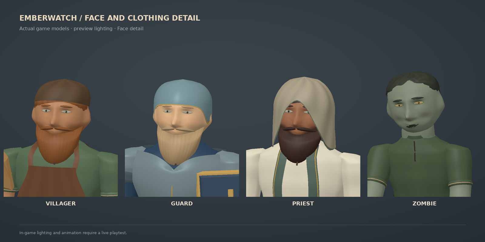

# Natural character redesign

## Visible backpack upgrades

Purchased backpack tiers now appear on the dwarf’s back in both local and remote player models. Simple leather, reinforced canvas with side pouches, and expedition packs with a bedroll have different silhouettes. Tier zero adds no backpack. Straps fit around the torso; the guard receives roomier straps for the armor. The pack follows the body during movement, riding, carrying and downed poses, survives job changes, and disappears when manual respawn removes the upgrade.

The model uses cached, curved sewn panels and batches details into four, five or six extra meshes by tier. Changing an actor’s tier or disposing another character does not destroy shared equipment geometry. `scripts/preview-backpacks.mjs` exports the actual game meshes for the existing CPU renderer.



This image is an offline render of game geometry. Browser lighting and motion still require a live playtest.

## Follow-up: sideways tool grips

The sword correction did not update the gathering tools' legacy attachment. Axe, pickaxe, hammer, scythe and staff handles now pass through the sculpted finger opening. A bent elbow carries them upright with their working heads facing forward. The bow is held at its actual handle, and its arrow runs along the bow's firing plane. Sword poses retain their established grip.

Working strokes were adjusted for the new arm position: the pickaxe reaches low ore, the hammer and axe descend ahead, and the scythe rolls around its shaft to sweep a level blade through the stalks. The grip stays fixed during walking and striking; equipment is stowed while riding or carrying another player.

[Corrected tool preview](previews/tool-grips.jpg) uses actual game geometry with preview lighting. The full suite passes **151 tests**, including three new tool-grip regression tests across roles and tiers, stable grips through motion, low mining contact, horizontal scythe cutting and forward bow aim. The previous sword tests also pass. Actual WebGL playback still requires a live playtest.

To reproduce this four-tool lineup:

```sh
node scripts/preview-characters.mjs public/src/characters.js /tmp/tools.json -.5 idle tools
python scripts/render-character-preview.py /tmp/tools.json /tmp/tools.jpg 'EMBERWATCH / CORRECTED TOOL GRIPS'
```

This replaces the previous smoothing-only proposal after Tyler's feedback that the characters still looked assembled from obvious shapes. It uses more natural adult proportions, continuous facial surfaces, connected wrists and hands, fitted clothing, and formed armor. It remains a proposed visual direction awaiting Tyler's review and has not been deployed.





## Construction

- Face, nose, cheeks, eye sockets, lips, ears and skull share a sculpted surface. Eyes are inset patches with colored irises; the beard follows the jaw and grows into a continuous groomed shape. Hair detail comes from geometry and vertex shading.
- A blended field creates connected forearm, wrist, palm, thumb and finger surfaces. Bone weights deform the exposed anatomy through the existing tool and movement poses.
- Tailored garments follow the torso and shoulders, with seams, folds, pockets, laces and procedural fabric/leather grain. Sleeves and skirts use skeletal deformation, not cloth physics.
- Zombies have narrower frames, hollowed cheeks, recessed eyes, slack mouths, receding gray hair and torn clothing.
- Material batching preserves vertex colors and texture coordinates. Cached anatomy and shared garment materials are reused; owned geometry, head materials and skeletons are disposed on role changes and removal.

No imported character assets or generated concept art are used. The images render actual game geometry and posed bone transforms with a CPU depth buffer and studio lighting. They do not reproduce the game's WebGL lighting, shadows or material bump maps.

## Validation

Nine targeted tests pass (`node --test test/characters.test.js test/motion.test.js`). They cover all sixteen role/appearance combinations, valid indexed geometry, vertex colors, normalized bone influences, translated actors in attack/riding/carrying/downed poses, shared-resource safety, skeleton cleanup and multiplayer pose playback. The existing animation probe was updated to include bones and passes at 30, 60 and 120 Hz across seven role/tool combinations, including distinct tool swings and role changes.

Front, reverse, face close-up and strike renders were inspected to correct open shoulders, elbow discontinuities, armor/cuff overlaps, apron interference, robe/hip clearance and belt clipping. Final front and detail images use the same geometry export.

| Character in the preview | Triangles | Meshes | Skinned meshes |
| --- | ---: | ---: | ---: |
| Villager with axe | 41,782 | 34 | 6 |
| Guard with sword/shield | 48,474 | 44 | 3 |
| Priest with staff | 42,794 | 37 | 12 |
| Zombie | 34,370 | 24 | 2 |

This proposal has more geometry than the earlier primitive models. These are scene measurements, not a frame-rate guarantee. Actual WebGL appearance, eight-player performance and large zombie waves still require live playtesting; the available cloud browser has WebGL disabled. Gameplay rules, save data, networking and the production branch are unchanged by this proposal.

## Reproduce the previews

From the repository root, with npm dependencies installed and Python with NumPy, Pillow and DejaVu Sans available:

```sh
node scripts/preview-characters.mjs public/src/characters.js /tmp/characters.json
python scripts/render-character-preview.py /tmp/characters.json /tmp/characters.jpg 'EMBERWATCH / CHARACTER REDESIGN'
python scripts/render-character-preview.py /tmp/characters.json /tmp/character-detail.jpg 'EMBERWATCH / FACE AND CLOTHING DETAIL' --heads
```

The exporter accepts yaw as its fourth argument (`2.86` for the reverse view) and a pose as its fifth: `idle`, `walk`, `strike`, `mounted`, `carry` or `downed`. The scripts are development tools and are not loaded by the game.
