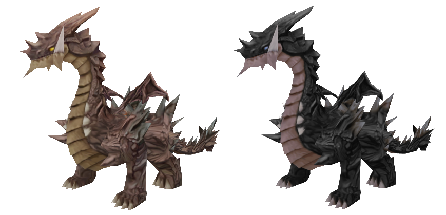
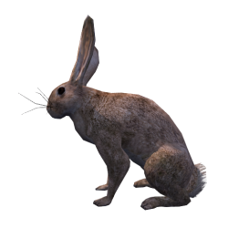
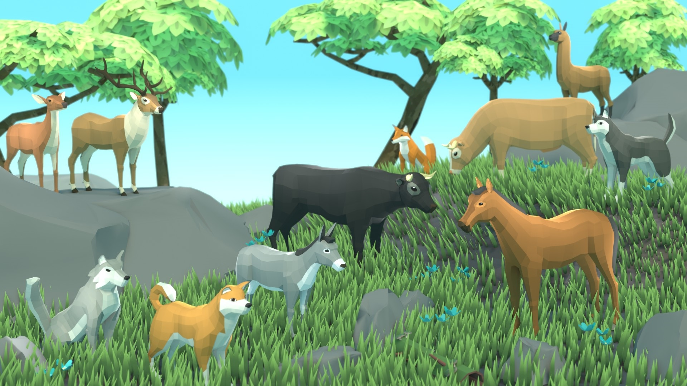

# Build 32 — free pet asset research archive

**Superseded by the approved implementation:** see [Pet companions](PET-COMPANIONS.md) for the current roster, final egg odds, abilities and actual imported models. The material below records the earlier research; its pending/disabled statements are historical. Publication of the completed Build 32 implementation was authorized September 22, 2026.

Updated 21 September 2026. Tyler prefers **free assets**. Most pets should attack nearby enemies, with rarer pets dealing more damage; small utility companions such as squirrels and rabbits can increase maximum carrying capacity. These directions supersede the earlier paid-model recommendations and scouting-only pet ideas. **Nothing is pushed or deployed.** This research does not activate species, buy models, or implement pet combat.

## Recommended first choices

Start visual review with the **textured rabbit, boar, Cethiel dragon and vampire bat**. They have free creator downloads, CC0 licensing, and existing rigs/animation. The rabbit, dragon and Quaternius animal-pack creator previews were inspected directly. The rabbit shows fur detail; the dragon uses stylized painted scales. They still need conversion, lighting, animation and multiplayer performance checks inside Emberwatch.

| Candidate | Verified free source / license | What is supplied | Proposed use / remaining work |
| --- | --- | --- | --- |
| **Rabbit — CDmir / TinyWorlds** | [Creator listing](https://opengameart.org/content/rabbit-0), CC0 | Rigged and animated; diffuse and normal maps. Blender file and FBX archive. Creator previews show running, sitting and guarding. | Utility companion, initially +20% carry capacity. Strong textured woodland option. Convert to GLB and check ground contact. |
| **Boar — Teh_Bucket** | [Creator listing](https://opengameart.org/content/boar), CC0 | Approximately 1,000 triangles; textured and rigged, with walk and attack animations; Blender file. | Uncommon melee pet. Existing attack clip is useful; needs GLB conversion and consistent movement speed. |
| **Dragon — Drummyfish / Cethiel** | [Creator listing](https://opengameart.org/content/cethiels-dragon-3d), CC0 | Rigged 1,262-triangle dragon; two 472×420 painted textures; separate idle/walk/attack/death DAE files verified in its ZIP. Creator preview inspected. Paid extra textures are not included. | Legendary combat pet, reduced to companion scale. Painted detail makes this a stronger free texture candidate. DAE-to-GLB conversion and animation quality still need in-game checks. |
| **Vampire bat / frost bat — rubberduck** | [Creator listing](https://opengameart.org/content/vampire-bat-animated), CC0 | Rigged/animated Blender source; 2K diffuse/normal maps and frost variant verified in ZIP; 7,732 triangles per creator listing. | Rare flying combat pet. Review flight/attack clips and reduce geometry if required; frost effects would be original game behavior, not supplied automatically. |
| **Wolf, fox, husky and Shiba Inu — Quaternius Ultimate Animated Animal Pack** | [Creator pack](https://quaternius.com/packs/ultimateanimatedanimals.html), CC0 | Twelve animals; creator states more than twelve animations per animal, including attack and locomotion; FBX, OBJ, Blender and glTF. | Broad matching set of common/uncommon/rare combat companions. Actual creator preview shows a visibly simpler, angular style; not detailed fur assets. Verify each chosen model's clips from the downloaded pack. |
| **Owl, boar and marmot — Gobkit Animal Pack B** | [Creator pack](https://gobkit.itch.io/gobkit-free-animal-pack-vol-2), CC0 | Ten free GLB creatures; baked color atlas, rig and idle/attack/death/walk animation ranges at 24 FPS. Creator offers a free ZIP and a [public file manifest](https://gobkit.com/api/free). | Owl for combat; marmot as a utility alternative. Practical browser format but simple unlit surfaces. Animation ranges need separating; textures/materials need review before promising visual quality. |
| **Undead squirrel — CDmir / TinyWorlds** | [Creator listing](https://opengameart.org/content/undead-squirrel-animated), CC0 | Rigged/animated Blender source. Actual 3.5 MB ZIP inspected in memory: body/head diffuse and normal textures are present. | Cursed utility pet or a starting mesh for a normal squirrel. This is an undead design, not a verified ordinary squirrel. A friendly variant needs deliberate model/texture work. |
| **Owl — gholm / Tristan Lock, Jeremy Davidson and Matt Ebb** | [Creator listing](https://blendswap.com/blend/7951), CC0 | Textured, feathered, rigged owl with animated flight loop; older Blender 2.6 source, listing size 31.7 MB. | Higher-detail backup requiring substantial conversion/optimization; not a ready browser asset. Exact usable geometry and attack animation remain unverified. |
| **Griffin — VitSh** | [Creator model](https://sketchfab.com/3d-models/griffin-animated-a8852f113416426bb06e6bba49a525a9), **CC BY 4.0** | [Primary platform metadata](https://api.sketchfab.com/v3/models/a8852f113416426bb06e6bba49a525a9) confirms free download eligibility, 670 faces, 337 vertices and one animation. Attribution is required; commercial use is allowed. | Epic flying combat candidate. Exact texture resolution, original formats and clip purpose remain unverified; may need an attack animation. |
| **Small magical creatures — Quaternius Ultimate Monsters** | [Creator pack](https://quaternius.com/packs/ultimatemonsters.html), CC0 | Fifty fully animated monsters, with FBX/OBJ/Blender/glTF listed. Creator index includes dragon, bat, slime and mushroom themes. Flat-color materials: the creator marks this pack as not textured. | Optional magical-companion style family. Choose actual files after preview; do not assume every member has suitable movement or attack clips. |

The previously found [Khronos fox](https://github.com/KhronosGroup/glTF-Sample-Assets/blob/main/Models/Fox/README.md) remains another free option, but its complete animation/conversion requires **CC BY 4.0 attribution**, and its three verified clips are Survey, Walk and Run rather than a dedicated attack. The newer Quaternius animal set is the stronger first combat-pet investigation.

## Real creator previews

These are unmodified source previews, **not Emberwatch screenshots**.

**Dragon, brown and black free textures — Drummyfish / Cethiel:**

**Rabbit — CDmir / TinyWorlds:**

**Quaternius animal pack, simpler angular style:**

Preview provenance is recorded in [preview credits](previews/pets/CREDITS.md). No 3D model, texture package, or animation has been installed in the game by this research.

## Proposed rarity and combat rules

Tyler has chosen the overall direction; the values below are **proposals for review, not implemented balance**.

| Rarity | Base damage per hit | Initial attack interval | Base damage per second |
| --- | ---: | ---: | ---: |
| Common | 8 | 2 seconds | 4 |
| Uncommon | 12 | 2 seconds | 6 |
| Rare | 20 | 2 seconds | 10 |
| Epic | 32 | 2 seconds | 16 |
| Legendary | 50 | 2 seconds | 25 |

Use one equipped pet, attacking a nearby enemy while staying near its owner. A pet's damage should credit that owner for normal zombie kill/assist rewards. Validate attacks on the server, require actual range and an unobstructed attack, and stop attacks when the owner is absent/downed. No damage through closed gates or walls. Rarity should increase sustained damage even if individual species later use different attack speeds. Distinct attack types and bonuses can be chosen after assets are selected; this table does not commit every species to a particular rarity.

Utility pets replace damage with a useful equipped bonus. Initial examples: rabbit **+20% carrying allowance**, squirrel **+25%**, with a marmot available as another pack-carrying animal. These bonuses should not stack across unequipped pets and should not increase building/cart storage. Removing a carry pet must preserve every item and simply trigger encumbrance if the player is now overweight. Exact utility values and rarity scaling remain to agree.

Keep the existing 30-real-minute egg timer, permanent account unlocks and cross-village collection. Egg price, merchant offer chance, hatch rarity probabilities, species selection, death behavior and any special abilities remain separate balance decisions. Production egg sales stay disabled until real content is selected and integrated.

## Quality and licensing checks still needed

All main candidates above have creator listings declaring CC0 except the griffin, which requires CC BY 4.0 attribution. Preserve creator/source credit even when optional. See the [CC0 deed](https://creativecommons.org/publicdomain/zero/1.0/) for the stated reuse terms. Do not treat a free viewer, a ripped commercial-game model, a noncommercial-only license or a paid high-resolution upgrade as a suitable free asset.

Test chosen files in the game's lighting and camera: ground contact, motion scale, readable attack, cave visibility, texture filtering, load size and eight-player animation cost. Share geometry/textures where possible. Keep grounded animals on valid terrain and handle flying companions without blocking player movement. No in-game visual review of these candidate models has yet occurred.

The earlier paid 3DDisco owl/dragon/rabbit/squirrel recommendations are superseded by Tyler's free-only preference. They are not a purchase request or implementation dependency.
